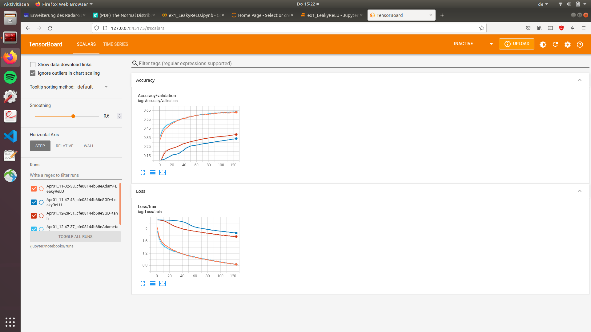

# Code for the first exercise of the Advanced Deep Learning course

This repository contains the code for the first exercise. The major discoveries were:
- Adam trains significantly faster than SGD
- In the beginning, the networks with tanh activations trains faster than the one with LeakyReLU, but at the end of the 25 epochs we trained the network, both give roghly the same accuracy.

