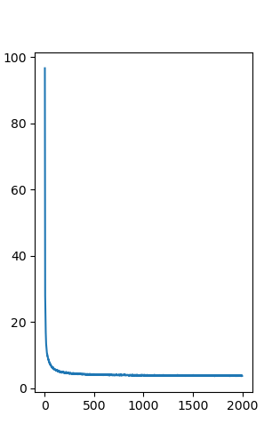

# char-rnn.pytorch

A PyTorch implementation of [char-rnn](https://github.com/karpathy/char-rnn) for character-level text generation. This is copied from [the Practical PyTorch series](https://github.com/spro/practical-pytorch/blob/master/char-rnn-generation/char-rnn-generation.ipynb).

## Training

Download [this Shakespeare dataset](https://raw.githubusercontent.com/karpathy/char-rnn/master/data/tinyshakespeare/input.txt) (from the original char-rnn) as `shakespeare.txt`.  Or bring your own dataset &mdash; it should be a plain text file (preferably ASCII).

Run `train.py` with the dataset filename to train and save the network:

```
> python train.py shakespeare.txt

Training for 2000 epochs...
(... 10 minutes later ...)
Saved as shakespeare.pt
```
After training the model will be saved as `[filename].pt`.

### Training options

```
Usage: train.py [filename] [options]

Options:
--model            Whether to use LSTM or GRU units    gru
--n_epochs         Number of epochs to train           2000
--print_every      Log learning rate at this interval  100
--hidden_size      Hidden size of GRU                  50
--n_layers         Number of GRU layers                2
--learning_rate    Learning rate                       0.01
--chunk_len        Length of training chunks           200
--batch_size       Number of examples per batch        100
--cuda             Use CUDA
```



This graph shows how the perplexity (y-Axes) changed over the training epochs (x-Axes).

## Generation

Run `generate.py` with the saved model from training, and a "priming string" to start the text with.

```
> python generate.py shakespeare.pt --prime_str "Where"

Where, you, and if to our with his drid's
Weasteria nobrand this by then.

AUTENES:
It his zersit at he
```

### Generation options
```
Usage: generate.py [filename] [options]

Options:
-p, --prime_str      String to prime generation with
-l, --predict_len    Length of prediction
-t, --temperature    Temperature (higher is more chaotic)
--cuda               Use CUDA
```

